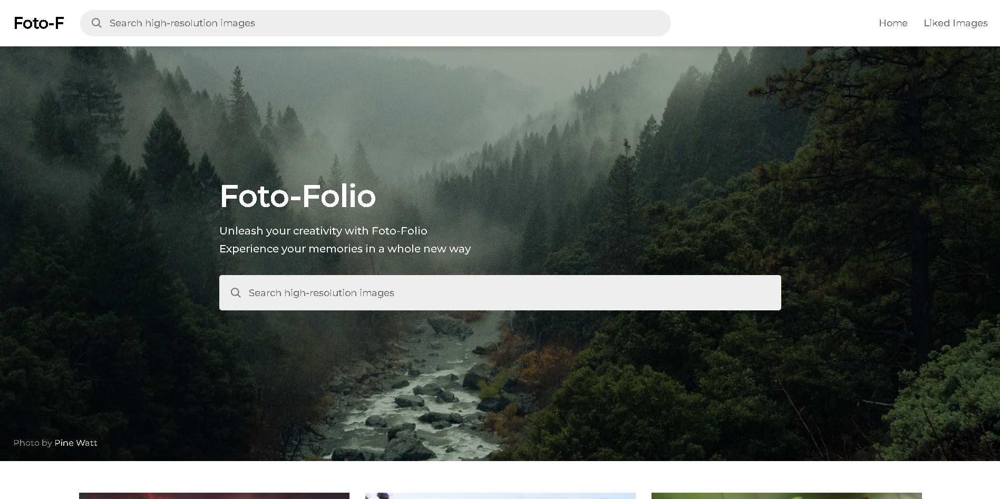

### [FotoFolio](https://foto-folio.vercel.app/)

## Project Introduction:

FotoFolio is a powerful and visually engaging full-stack photo gallery application, carefully designed and developed as a showcase piece for my portfolio. 

With FotoFolio, users can effortlessly navigate through an expansive database of high-quality images sourced from the Pixabay API. The application offers a rich suite of features such as the ability to search for specific images, download high-resolution photos directly, and 'like' favorite images for future viewing. This personalized 'liked images' collection persists across sessions using local storage, creating a tailored user experience.

The application was built keeping in mind the needs and desires of a modern-day user. It provides an infinite scroll experience for seamless browsing, and detailed views of each image with a simple click. Notably, it also features an asynchronous image loading system with clear loading statuses to enhance the user experience. The gallery layout is responsive, optimizing its display based on user screen size, ensuring a consistent and pleasant browsing experience on any device.

## About The Project:

FotoFolio is a full stack photo gallery website

The common functionalities are:

- Users can search for high-quality images based on their desired search term
- Users can download high-resolution images directly from the application
- Allows users to 'like' their favorite images, storing these images in a 'liked images' collection for future viewing. This collection persists in local storage
- The application provides a seamless scrolling experience, fetching more images as the user scrolls down the page, providing an infinite scroll experience
- By clicking on an image, users can access a detailed view of the selected image.
- Images are loaded asynchronously, with loading status indicated to the user, enhancing the user experience
- The image gallery layout is responsive, dynamically adjusting to optimize the viewing experience based on the number of images and the user's screen size

I'm using the [Pixabay API](https://pixabay.com/api/docs/) to get high quality images

Credit: Pixabay API

### Built With:

- React.js

- Node.js

- Express js

- CSS3

### Key Concepts:

- Cors

- Local Storage

- Axios

- Path

- Responsive Web Design

- API Consumption

- Component-based Architecture

